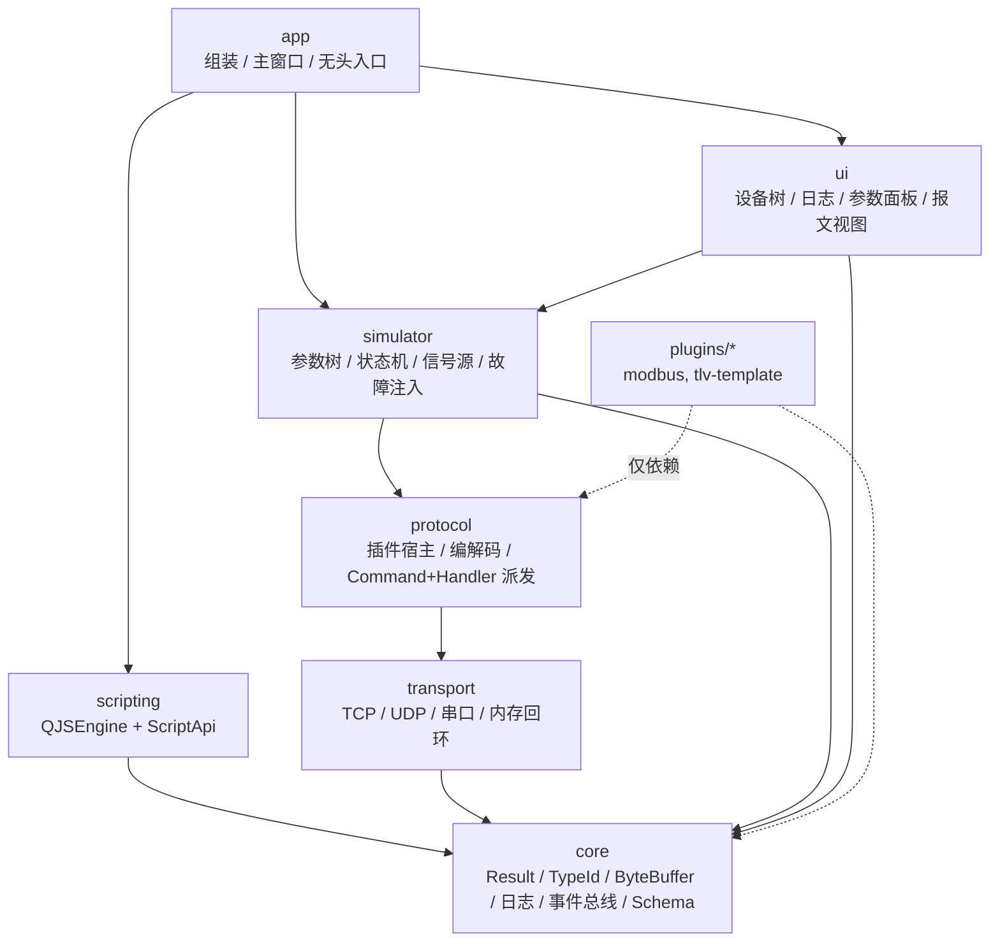
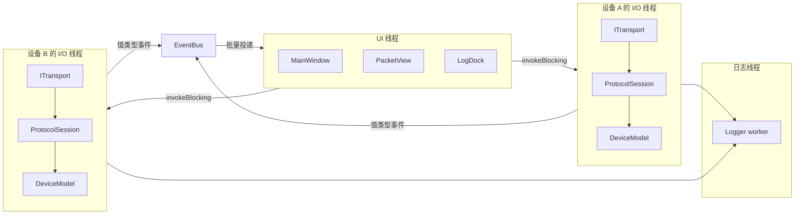
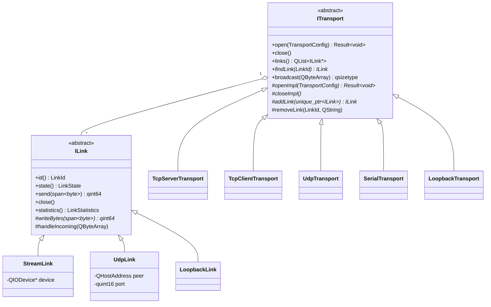
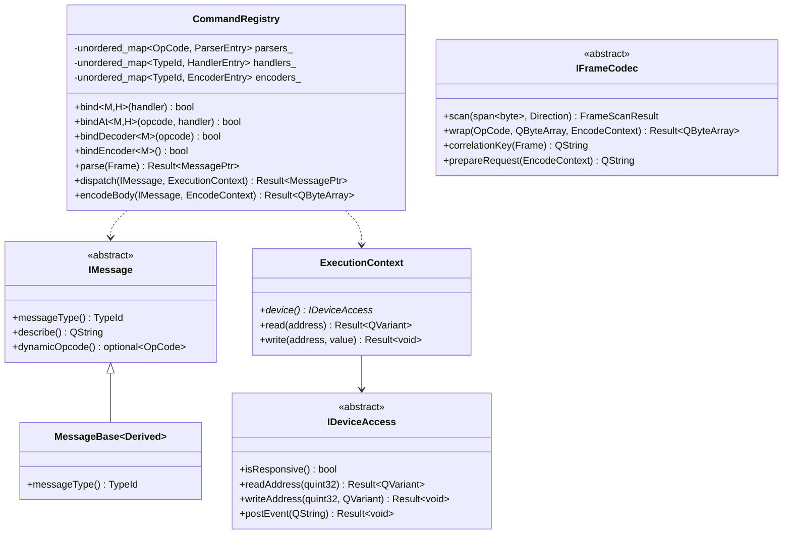
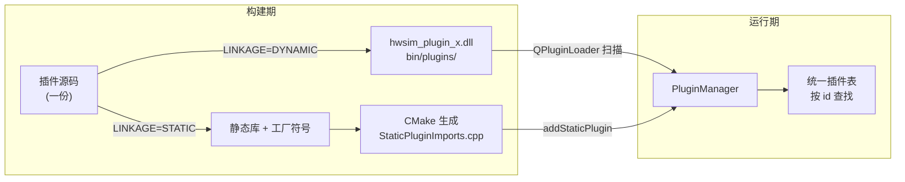
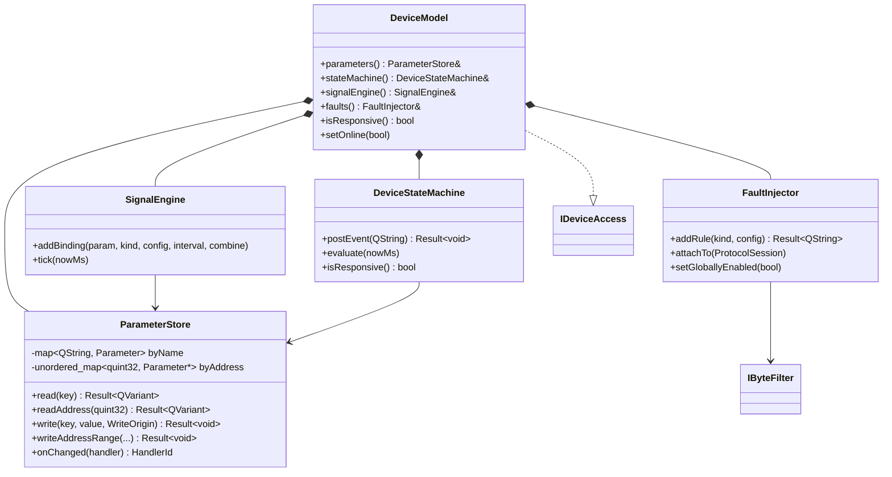
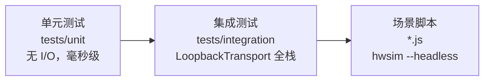

# 设备协议模拟平台 — 架构设计

Qt 6.5 LTS + C++20，MSVC 2019/2022。目标是一个**双向对等**的设备协议模拟平台：
既能扮演下位机从站等上位机来连，也能作为主站去测真实设备；协议以插件形式扩展，
新增协议不修改框架任何一行代码。

---

## 1. 分层与依赖方向

依赖严格单向向下，跨层只通过接口。这不是形式主义：它决定了协议插件能被独立编译、
设备模型能被单测、UI 能被整个摘掉跑无头 CI。



关键点：

- **plugins 只依赖 protocol 和 core**。插件看不到 simulator、transport 具体类型和 UI，
  因此一份插件二进制在四种传输上、在主站和从站两种角色下都能用。
- **protocol 不依赖 simulator**。Handler 通过 `IDeviceAccess` 访问设备，
  由 `simulator::DeviceModel` 实现——依赖被反转了。单测里塞一个二十行的 stub 就能测 Handler。
- **ui 不依赖 app**。面板通过 `ui::IDeviceController` 拿数据，`app::Workspace` 实现它。

---

## 2. 线程模型

一句话：**一台设备 = 一个 I/O 线程，该设备的传输、协议会话、设备模型全在这个线程上，无锁。**



三条规则：

1. **Qt 信号槽只用于同线程接线**（`ITransport::linkOpened(ILink*)` 传裸指针给同线程的会话）。
2. **跨线程一律走 `core::EventBus`，只传值拷贝**（`ProtocolFrameEvent`、`ParameterChangedEvent`……）。
   UI 永远拿不到指向别的线程对象的指针。
3. **UI 要主动读设备状态时，走 `DeviceRuntime::invoke`**，在设备线程上同步执行再返回。
   `Workspace` 是唯一做这件事的地方。

唯一带锁的是 `ParameterStore`——它是脚本、UI、协议三方天然的共享点，加锁比到处 marshal 划算。

---

## 3. 通讯层：Transport / Link 二分



**Transport 是端点，Link 是会话。** 这个二分让一套抽象覆盖四种传输：

| 传输 | 端点数 | 链路数 |
| --- | --- | --- |
| TCP 服务端 | 1 | 每个接入的客户端一条 |
| TCP 客户端 | 1 | 1 |
| UDP | 1 | 按对端地址虚拟出 N 条 |
| 串口 | 1 | 1 |

UDP 的"虚拟链路"是关键设计：每个对端拿到独立的重组缓冲和独立的协议会话状态，
上层写代码时和 TCP 完全一样。

`LoopbackTransport` 把两个端点在内存里对接，**投递永远经过事件循环**——
从站在自己的读回调里回包不会递归回发送方。整个集成测试套件不开一个端口。

---

## 4. 协议层：Command + Handler，零 switch-case

这是整个架构的核心。传统写法会出现三处并列的 switch：解码时 switch 功能码、
派发时 switch 消息类型、编码时再 switch 一次。这里用**三张哈希表**替代：



一次 `bind<M>(handler)` 同时填好三张表：

```cpp
registry.bind<ReadHoldingRegisters>(std::make_shared<ReadHoldingRegistersHandler>(map));
```

加一个报文 = 一个消息类 + 一个 Handler + 一行注册。`HandlerFor<H, M>` concept
保证签名对不上时**在注册那一行**报错，而不是模板实例化的深处。

`TypeId` 用类型名的 FNV-1a 哈希做 key（不是静态变量地址），因为消息类型定义在插件 DLL 里，
Windows 上跨模块的静态变量地址不保证唯一。

### 4.1 会话编排

```mermaid
sequenceDiagram
    participant Link as ILink
    participant Filt as 入站 ByteFilter
    participant Buf as ByteBuffer
    participant Codec as IFrameCodec
    participant Reg as CommandRegistry
    participant MW as MiddlewareChain
    participant H as Handler
    participant Dev as IDeviceAccess
    participant Out as 出站 ByteFilter

    Link->>Filt: bytesReceived
    Filt-->>Filt: 丢包 / 延迟 / 篡改
    Filt->>Buf: append
    loop 直到 NeedMoreData
        Buf->>Codec: scan(readable)
        alt FrameReady
            Codec->>Reg: parse(frame)
            Reg->>MW: run(request)
            MW->>H: dispatch
            H->>Dev: readRange / write
            Dev-->>H: 值
            H-->>MW: 响应报文
            MW->>Reg: encodeBody
            Reg->>Codec: wrap(opcode, body)
            Codec->>Out: 完整帧
            Out-->>Out: CRC 错误 / 截断 / 丢弃
            Out->>Link: send
        else Discard
            Buf-->>Buf: 丢弃并重同步
        end
    end
```

两个扩展点，职责分得很干净：

- **`IMiddleware`（报文级）**：日志追踪、统计、状态门控、限流。可以短路整条链。
- **`IByteFilter`（字节级）**：故障注入。作用在**成帧之后、发送之前**的完整字节上。

故障注入放在字节级是刻意的：协议插件里永远不会出现 `if (故障开关)` 这种分支，
而且同一套故障对任何协议、任何传输都生效。

---

## 5. 插件机制



同一份源码，`HWSIM_EXPORT_STATIC_PLUGIN` 宏在动态构建下展开为空。
`PluginManager` 把两类插件放进同一张表，下游分辨不出区别。

加载要过三道校验，任何一道不过只记录在 `failures()` 并在 UI 显示，不影响主程序：
IID 匹配（在**实例化之前**校验）→ `abiVersion()` 匹配 → id 非空且未占用。

详见 [plugin-dev-guide.md](plugin-dev-guide.md)。

---

## 6. 设备仿真层



几个值得说明的设计决定：

**读写权限只约束协议侧。** `AccessMode::ReadOnly` 意思是"主站不能写"，
但操作员和信号源必须能写——否则只读的传感器读数永远无法变化，模拟器就没意义了。
这个不对称由 `WriteOrigin` 在 `ParameterStore` 里落实。

**多绑定叠加。** 同一个参数可以挂多个信号源，按顺序 replace / add / multiply 组合。
"正弦 + 高斯噪声"就是两条绑定，不需要专门的复合信号源类型。

**一个定时器。** 一台设备五十路信号也只有一个 tick，避免定时器漂移导致数据不可复现。

**多寄存器写是全有或全无。** `writeAddressRange` 先校验整段再落盘，
越界的多寄存器写不会留下半截状态。

**故障规则清单**：`packet-loss` 丢包、`timeout` 抑制响应、`latency` 附加时延、
`checksum-error` 篡改校验、`bit-flip` 误码、`truncation` 截断、`garbage` 插入乱码、
`disconnect` 主动断链。每条都有方向（收/发/双向）和触发方式（每帧/概率/每 N 帧/手动）。

---

## 7. Schema 驱动的 UI

`core::ConfigSchema` 是把 UI 从业务里解耦出来的关键。传输、编解码、信号源、故障规则、
协议插件全都发布自己的 schema，`ui::SchemaFormWidget` 据此生成编辑器。

结果是：**新增一个协议插件，配置面板自动就有了**，UI 模块一行不用改。
`visibleWhen` 表达式（`"mode==client"`）让依赖字段随编辑实时显隐。

---

## 8. 自动化测试

三层，越往下越快：



- **单测**：Handler 配 stub `IDeviceAccess`；codec 直接喂字节；注册表、中间件、故障规则独立验证。
- **集成**：`LoopbackTransport` 把主从两侧在内存里对接，跑完整管线——组帧、派发、
  设备读写、故障注入。不开端口、不要串口、CI 里零依赖。
- **场景脚本**：`hwsim --headless --workspace w.json --script s.js`，
  退出码即测试结论，直接当 CI 门禁。

---

## 9. 目录结构

```
硬件仿真模拟器/
├── CMakeLists.txt
├── CMakePresets.json              msvc2022 / msvc2019 / ninja / 静态插件变体
├── cmake/
│   ├── QtSetup.cmake              Qt6 组件定位
│   ├── CompilerWarnings.cmake     /W4 /permissive- /utf-8
│   ├── Cpp20Features.cmake        探测 <format>/ranges，产出 HWSIM_HAS_* 宏
│   ├── HwSimHelpers.cmake         hwsim_add_library / hwsim_add_test
│   └── AddProtocolPlugin.cmake    动/静态插件构建 + 静态导入文件生成
├── docs/
│   ├── architecture.md            本文
│   └── plugin-dev-guide.md        新增协议插件指南
├── src/
│   ├── core/                      Result, TypeId, ByteBuffer, Endian, Crc,
│   │                              Logger, LogSinks, EventBus, Registry, ConfigSchema
│   ├── transport/                 ITransport, ILink, StreamLink,
│   │                              Tcp{Server,Client}/Udp/Serial/Loopback,
│   │                              TransportFactory, TransportThread, TransportEvents
│   ├── protocol/                  IMessage, CommandRegistry, IFrameCodec,
│   │                              IMiddleware, IByteFilter, ExecutionContext,
│   │                              IDeviceAccess, PendingRequestTable,
│   │                              ProtocolSession, IProtocolPlugin, PluginManager
│   ├── simulator/                 Parameter, ParameterStore, DeviceStateMachine,
│   │                              ISignalSource, SignalSources, SignalEngine,
│   │                              FaultRules, FaultInjector, DeviceModel, DeviceProfile
│   ├── scripting/                 IScriptHost, ScriptApi, ScriptEngine
│   ├── ui/                        SchemaFormWidget, DeviceTreeWidget, LogDockWidget,
│   │                              PacketView, ParameterPanel, ScenarioPanel,
│   │                              IDeviceController
│   └── app/                       DeviceRuntime, Workspace, ScriptHostAdapter,
│                                  AddDeviceDialog, MainWindow, CliOptions, main
├── plugins/
│   ├── modbus/                    Modbus RTU + TCP，主从双角色
│   └── template/                  私有 TLV 协议脚手架
├── tests/
│   ├── unit/                      tst_core / tst_transport / tst_protocol / tst_simulator
│   ├── integration/               tst_endtoend / tst_scripting
│   └── fixtures/                  样例设备档案与场景脚本
└── scripts/
    └── ci.ps1                     配置 + 构建 + ctest
```

---

## 10. C++20 用在哪里

| 特性 | 用途 |
| --- | --- |
| concepts | `HandlerFor<H,M>`、`DecodableMessage<T>` 把注册错误挡在调用点 |
| `std::span` | 零拷贝字节视图，贯穿 codec 与 CRC |
| `constexpr` 容器与算法 | CRC 查表在编译期生成 |
| `std::bit_cast` | 浮点与整数的位级转换，无 UB |
| `<bit>` / `std::byteswap` | 字节序处理（MSVC 2019 上自动回退到手写实现） |
| 指定初始化器、`<=>` | 配置结构体与 TypeId 比较 |
| `std::erase_if` | 各处容器清理 |

`<format>` 与部分 `ranges` 在 MSVC 2019 上缺失，由 `Cpp20Features.cmake` 探测后
定义 `HWSIM_HAS_STD_FORMAT` 等宏，调用点据此选择 Qt 原生实现，不在源码里散落编译器版本判断。

---

## 11. 扩展指引

| 要加什么 | 改哪里 | 是否动框架 |
| --- | --- | --- |
| 新协议 | 复制 `plugins/template/`，写消息类 + Handler + codec | 否 |
| 新传输（如 CAN） | 继承 `ITransport`，在 `TransportFactory` 注册，加一个 schema | 否 |
| 新波形 | 继承 `ISignalSource`，在 `signalSourceRegistry()` 注册 | 否 |
| 新故障类型 | 继承 `FaultRuleBase`，在 `faultRuleRegistry()` 注册 | 否 |
| 新中间件 | 继承 `IMiddleware`，`session.middleware().add(...)` | 否 |

上面每一项，UI 面板都会由 schema 自动生成。
